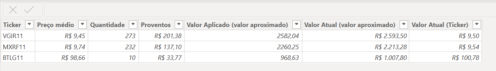

# Acompanhamento Detalhado de Fundos Imobiliários através do Power BI

Este projeto tem como objetivo permitir que investidores de fundos imobiliários acompanhem detalhadamente toda a sua carteira através de um Dashboard. A ideia é possibilitar que eles adicionem informações dos fundos que compõem suas carteiras e, com isso, visualizem os detalhes de desempenho.

## Adição de informações:
O objetivo é que o investidor adicione as informações de seus fundos imobiliários:
- Ticker
- Preço Médio
- Quantidade 
- Proventos
- Valor aplicado (talvez não seja necessário)

Com base nas informações fornecidas, pretendo automatizar as demais colunas finais para que as informações sejam trazidas automaticamente. Obs: Os dados são simulados.

### Próximas implementações:
- Automatizar o preenchimento de algumas colunas usando python
- Adicionar a coluna de mês
- Verificar outras alterações possíveis, principalmente em relação a visualização do Dashboard.